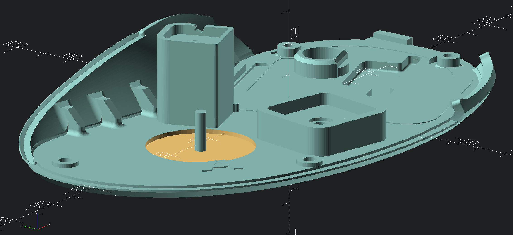
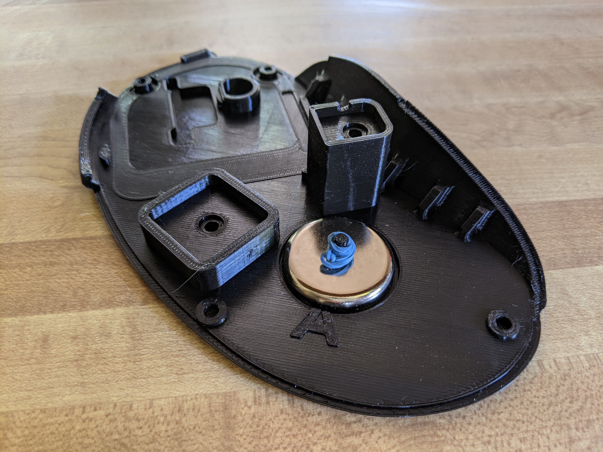

# Ploopy Magnet Mod

Want to use a tented/tilted metal keyboard tray with your Ploopy? Tired of having it slide off when you get up? Need to use your Ploopy *in space?* Look no further, the Ploopy Magnet Mod is here.

All you need is:

  * a metal work surface you plan to use the Ploopy on (otherwise this mod is useless)
  * a 3D print of this model, which replaces the base of your Ploopy
  * a neodymium cup magnet, 32 mm diameter with M5 screw hole ([I used this rated for 95 LB, which was probably overkill](https://www.amazon.com/dp/B08VMWZ54T)),
  * a rubber band to keep the magnet from falling off the mounting cylinder when lifted
  * new adhesive feet to stick on the base. I recommend the clear, soft ones intended for glass rather than friction pads like the ones the Ploopy ships with, otherwise else you may have difficulty repositioning your ploopy at all.
  * 2 M3 heat set inserts to stick in the button mounting holes in this replacement base.

### Model Preview

### How to Secure the Magnet with a Rubber Band

